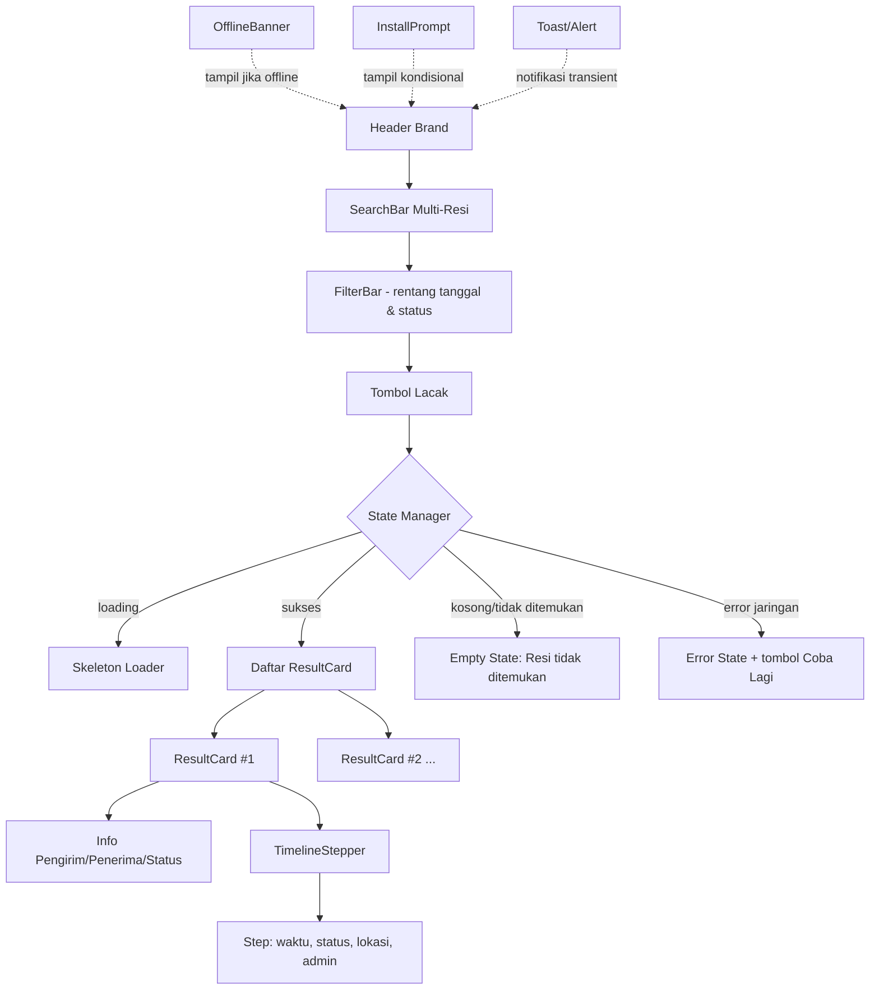
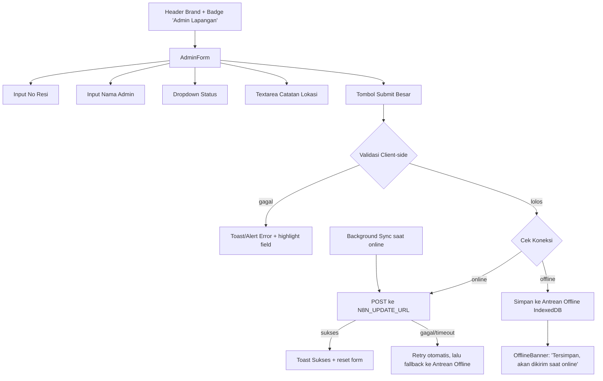

# Arsitektur Frontend PWA — Metro Logistik Indonesia

**Dokumen:** Arsitektur Komponen Frontend PWA (Web Dashboard & Tracking)
**Proyek:** Web Dashboard & Tracking PWA — Metro Logistik Indonesia (metrologistikindonesia.com)
**Dibuat oleh:** Software Architect & UI/UX Designer (Claude)
**Tanggal:** 2026-07-05
**Audiens:** Programmer implementasi (Opus), Tim n8n Workflow, Project Manager

---

## 1. Tujuan & Prinsip Desain

Aplikasi ini adalah **Progressive Web App (PWA)** untuk:
1. **Halaman Publik** — pelanggan mengecek status pengiriman (mendukung banyak nomor resi sekaligus).
2. **Halaman Admin Lapangan** — petugas lapangan meng-update status & posisi barang dari HP, sering dengan sinyal lemah.

Prinsip desain:
- **Mobile-first, web-friendly** — dirancang untuk layar kecil dulu, lalu diperluas ke desktop.
- **Installable** di iOS (Add to Home Screen via Safari) dan Android (prompt install PWA native).
- **Tanpa framework, tanpa build step** — HTML statis + Tailwind CSS via CDN + Vanilla JS. Programmer cukup edit file dan buka di browser, tidak perlu `npm install`/bundler.
- **Backend tanpa server kustom** — seluruh logika backend berupa **webhook n8n**, penyimpanan data di **Google Sheets**.
- **Tangguh di sinyal lemah** — retry otomatis, timeout wajar, dan indikasi status jaringan yang jelas.

---

## 2. Stack Teknologi

| Layer | Teknologi | Catatan |
|---|---|---|
| Markup | HTML5 statis | Tidak ada templating server-side |
| Styling | Tailwind CSS via CDN (`<script src="https://cdn.tailwindcss.com">`) | Tidak ada proses build/PostCSS. Konfigurasi tema inline via `tailwind.config` di `<script>` jika perlu. |
| Interaktivitas | Vanilla JavaScript (ES2017+, modul `<script type="module">` opsional) | Tidak ada React/Vue/Svelte |
| PWA | `manifest.json` + `sw.js` (Service Worker API native browser) | Tidak ada Workbox/build tool wajib; boleh ditulis tangan |
| Backend logika | Webhook **n8n** (2 workflow: WF1 = GET tracking, WF2 = POST update admin) | n8n berjalan di server terpisah (self-host/cloud n8n) |
| Database | **Google Sheets** (via node Google Sheets di n8n) | Spreadsheet Utama + Spreadsheet Archive (lihat dokumen skema database) |
| Hosting frontend | Static hosting (Netlify/Vercel/GitHub Pages/VPS Nginx) — bebas, karena hanya file statis | HTTPS wajib untuk Service Worker & installability |

Tidak ada dependency npm, tidak ada `package.json` wajib, tidak ada compiler. Semua library pihak ketiga (jika ada, misalnya ikon) diambil via CDN dengan tag `<script>`/`<link>` langsung di HTML.

---

## 3. Struktur File Wajib

Programmer (Opus) **wajib** mengikuti struktur folder berikut persis, agar konsisten dengan dokumen wireframe dan skema data:

```
app/
├── index.html            # Halaman publik: cek resi & timeline tracking
├── admin.html            # Halaman admin lapangan: form update status
├── manifest.json         # Web App Manifest (PWA metadata, ikon, tema)
├── sw.js                 # Service Worker (cache app-shell + strategi data API)
├── js/
│   ├── config.js         # Konstanta konfigurasi (URL webhook n8n, timeout, dsb.)
│   ├── tracking.js        # Logika halaman publik (fetch, render, retry, cache)
│   └── admin.js          # Logika halaman admin (form, validasi, antrean offline)
└── icons/
    ├── icon-192.png       # Ikon PWA 192x192 (Android)
    ├── icon-512.png       # Ikon PWA 512x512 (Android/splash)
    ├── icon-maskable-192.png   # Varian maskable (safe zone Android adaptive icon)
    ├── icon-maskable-512.png
    └── apple-touch-icon.png   # 180x180, khusus iOS Home Screen
```

Catatan struktur:
- Tidak boleh ada file HTML/JS tambahan di luar struktur ini tanpa perubahan dokumen arsitektur (agar tetap simpel dan mudah dirawat oleh tim non-engineering).
- CSS kustom (di luar utility Tailwind) — jika benar-benar dibutuhkan — ditulis inline di `<style>` pada masing-masing HTML, **bukan** file `.css` terpisah, untuk menjaga jumlah file tetap minimal. Jika kebutuhan CSS kustom membesar, boleh ditambahkan `app/css/style.css` dengan persetujuan arsitek.
- `js/config.js` adalah **satu-satunya tempat** yang menyimpan URL webhook. Tidak boleh ada URL n8n yang di-hardcode di file lain.

### Isi wajib `js/config.js` (kontrak, bukan kode final)

```js
// app/js/config.js
// Placeholder — ganti dengan URL webhook produksi n8n sebelum deploy.
const N8N_GET_URL    = "https://n8n.metrologistikindonesia.com/webhook/tracking-get";    // WF1 (GET)
const N8N_UPDATE_URL = "https://n8n.metrologistikindonesia.com/webhook/tracking-update"; // WF2 (POST)

const CONFIG = {
  N8N_GET_URL,
  N8N_UPDATE_URL,
  FETCH_TIMEOUT_MS: 8000,     // batas waktu tunggu request (sinyal lemah)
  MAX_RETRY: 2,               // percobaan ulang otomatis saat fetch gagal/timeout
  RETRY_BACKOFF_MS: 1500,     // jeda antar-retry (naik bertahap: 1.5s, 3s)
  CACHE_KEY_PREFIX: "metro_track_",   // key localStorage untuk cache hasil lacak
  OFFLINE_QUEUE_KEY: "metro_admin_queue", // key penyimpanan antrean update offline
  APP_NAME: "Metro Logistik Indonesia",
};
```

---

## 4. Diagram Komponen

### 4.1 Halaman Publik (`index.html` + `tracking.js`)



Breakdown komponen (implementasi sebagai fungsi render di `tracking.js`, bukan komponen framework):

| Komponen | Deskripsi | Elemen kunci |
|---|---|---|
| **Header Brand** | Logo teks/gambar "Metro Logistik Indonesia", warna primary, sticky di top | `<header>` |
| **SearchBar Multi-Resi** | `<textarea>` menerima banyak resi dipisah koma/baris baru + tombol "Lacak" | parsing input → array resi |
| **FilterBar** | Filter rentang tanggal (dari–sampai) & dropdown status, diterapkan ke hasil yang sudah di-render (client-side filter) | `<input type="date">` x2, `<select>` |
| **ResultCard** | Kartu per nomor resi: header (no resi, status badge), info pengirim/penerima, tombol expand/collapse timeline | 1 kartu = 1 resi |
| **TimelineStepper** | Daftar vertikal berundak, titik + garis penghubung, entri terbaru di atas | lihat dokumen wireframe untuk detail visual |
| **Toast/Alert** | Notifikasi transient (mis. "Berhasil disalin", "Gagal memuat 1 resi") | posisi fixed bottom, auto-dismiss 3 detik |
| **OfflineBanner** | Banner sticky di atas saat `navigator.onLine === false`, menyatakan data yang tampil adalah cache terakhir | warna warning |
| **InstallPrompt** | Tombol/banner "Instal Aplikasi" muncul saat event `beforeinstallprompt` (Android/Chrome) atau instruksi manual (iOS) | lihat §6.4 |
| **Skeleton Loader** | Placeholder abu-abu berbentuk ResultCard saat menunggu respons | animasi pulse Tailwind |

### 4.2 Halaman Admin Lapangan (`admin.html` + `admin.js`)



| Komponen | Deskripsi |
|---|---|
| **AdminForm** | Form ringkas 1 kolom (mobile-first), semua input besar & mudah disentuh |
| **Input No Resi** | Text input, wajib diisi |
| **Input Nama Admin** | Text input, wajib diisi, trim spasi |
| **Dropdown Status** | `<select>` dengan 6 opsi enum (lihat §5) |
| **Textarea Catatan Lokasi** | Deskripsi posisi/lokasi barang saat ini, bebas teks |
| **Tombol Submit** | Full-width, min-height 48px, disabled saat submitting |
| **Toast/Alert** | Feedback sukses (hijau) / gagal (merah) jelas & besar |
| **OfflineBanner** | Sama komponennya dengan halaman publik, pesan disesuaikan konteks admin |

---

## 5. Alur Data End-to-End

### 5.1 Halaman Publik → WF1 (GET)

```
[Browser: index.html]
   │  user input: "JX12345678, JX87654321"
   ▼
[tracking.js] parse → array ["JX12345678","JX87654321"]
   │  join dengan koma
   ▼
GET {N8N_GET_URL}?resi=JX12345678,JX87654321
   │
   ▼
[n8n WF1]
   │  1. Terima query param `resi`
   │  2. Split by koma → daftar no resi
   │  3. Lookup tiap no resi di Google Sheets "Tracking"
   │  4. Parse kolom Riwayat_Posisi_JSON → array riwayat
   │  5. Susun response JSON per resi (lihat kontrak §6)
   ▼
Response 200 JSON → [tracking.js] render ResultCard + TimelineStepper per resi
   │
   ▼
Simpan hasil ke localStorage (cache) dengan key `metro_track_<no_resi>`
```

### 5.2 Halaman Admin → WF2 (POST)

```
[Browser: admin.html]
   │  user isi form: no_resi, nama_admin, status, lokasi
   ▼
[admin.js] validasi client-side
   │  lolos
   ▼
POST {N8N_UPDATE_URL}
   Body JSON: { no_resi, nama_admin, status, lokasi }
   │
   ▼
[n8n WF2]
   │  1. Terima body POST
   │  2. Validasi ulang (server-side) field wajib
   │  3. Cari baris No_Resi di sheet "Tracking"
   │     - Jika ADA: append entri baru ke Riwayat_Posisi_JSON,
   │       update Status_Terakhir & Timestamp_Update
   │     - Jika TIDAK ADA (resi baru): buat baris baru,
   │       inisialisasi Riwayat_Posisi_JSON dengan 1 entri
   │  4. Simpan balik ke Google Sheets
   │  5. Kembalikan response sukses/gagal
   ▼
Response 200/4xx JSON → [admin.js] tampilkan Toast sukses/gagal
   │
   ▼
Jika gagal karena jaringan (bukan validasi) → simpan ke Antrean Offline,
kirim ulang otomatis saat online kembali
```

---

## 6. Kontrak API (Frontend ⇄ n8n)

Kontrak ini **mengikat** — Opus (programmer frontend) dan tim n8n **wajib** mengikuti struktur field, nama, dan tipe data persis seperti berikut agar tidak terjadi mismatch integrasi.

### 6.1 WF1 — GET Tracking (Halaman Publik)

**Request**

```
GET {N8N_GET_URL}?resi=JX12345678,JX87654321
```

| Parameter | Tipe | Wajib | Keterangan |
|---|---|---|---|
| `resi` | string (query param) | ya | Satu atau lebih no resi, dipisah koma tanpa spasi wajib (frontend boleh trim spasi sebelum kirim) |

**Response 200 — sukses (array, satu elemen per resi yang diminta)**

```json
{
  "results": [
    {
      "no_resi": "JX12345678",
      "found": true,
      "pengirim": "Toko Sinar Jaya, Jakarta",
      "penerima": "Budi Santoso, Surabaya",
      "status_terakhir": "Delivered",
      "timestamp_update": "2026-07-05T14:30:00+07:00",
      "riwayat": [
        {
          "waktu": "2026-07-01T09:00:00+07:00",
          "status": "Manifest",
          "lokasi": "Gudang Jakarta Pusat",
          "admin": "Andi Wijaya"
        },
        {
          "waktu": "2026-07-05T14:30:00+07:00",
          "status": "Delivered",
          "lokasi": "Alamat Penerima, Surabaya",
          "admin": "Rudi Hartono"
        }
      ]
    },
    {
      "no_resi": "JX87654321",
      "found": false,
      "pengirim": null,
      "penerima": null,
      "status_terakhir": null,
      "timestamp_update": null,
      "riwayat": []
    }
  ]
}
```

Catatan kontrak:
- `riwayat` **terurut dari yang paling lama ke paling baru** (kronologis, sesuai urutan append di Google Sheets). **Frontend** yang bertanggung jawab membalik urutan (`.reverse()`) untuk tampilan "terbaru di atas" pada TimelineStepper. Ini menjaga n8n tetap sederhana (hanya append, tidak perlu sort/reverse di server).
- `found: false` dipakai frontend untuk menampilkan state "Resi tidak ditemukan" khusus untuk resi tersebut, tanpa menggagalkan resi lain dalam batch yang sama.
- Field bernilai `null` ketika `found: false`.

**Response error (5xx / gagal total)**

```json
{
  "error": true,
  "message": "Terjadi kesalahan pada server. Coba lagi nanti."
}
```

### 6.2 WF2 — POST Update Admin (Halaman Admin)

**Request**

```
POST {N8N_UPDATE_URL}
Content-Type: application/json
```

```json
{
  "no_resi": "JX12345678",
  "nama_admin": "Rudi Hartono",
  "status": "Out for Delivery",
  "lokasi": "Dalam perjalanan menuju alamat penerima, area Rungkut Surabaya"
}
```

| Field | Tipe | Wajib | Keterangan |
|---|---|---|---|
| `no_resi` | string | ya | Nomor resi target update |
| `nama_admin` | string | ya | Tidak boleh kosong/hanya spasi |
| `status` | string enum | ya | Salah satu dari 6 nilai enum (lihat dokumen skema database) |
| `lokasi` | string | ya | Catatan posisi/lokasi barang saat ini |

**Response 200 — sukses**

```json
{
  "success": true,
  "message": "Status berhasil diperbarui.",
  "data": {
    "no_resi": "JX12345678",
    "status_terakhir": "Out for Delivery",
    "timestamp_update": "2026-07-05T16:45:00+07:00"
  }
}
```

**Response gagal (validasi server atau resi bermasalah)**

```json
{
  "success": false,
  "message": "Nama admin wajib diisi."
}
```

**Response error (5xx)**

```json
{
  "success": false,
  "message": "Gagal menyimpan ke database. Coba lagi."
}
```

Catatan kontrak:
- `admin.js` menampilkan `message` dari response langsung ke Toast (jadi pesan dari n8n harus berbahasa Indonesia yang ramah pengguna).
- Struktur `success: boolean` (bukan HTTP status code semata) dipakai supaya frontend punya sumber kebenaran yang eksplisit meski n8n mengembalikan HTTP 200 untuk kasus gagal validasi.

---

## 7. Strategi PWA

### 7.1 Web App Manifest (`manifest.json`)

Poin wajib:

```json
{
  "name": "Metro Logistik Indonesia - Tracking",
  "short_name": "Metro Logistik",
  "start_url": "/index.html",
  "display": "standalone",
  "background_color": "#0F3D5C",
  "theme_color": "#0F3D5C",
  "orientation": "portrait-primary",
  "icons": [
    { "src": "icons/icon-192.png", "sizes": "192x192", "type": "image/png", "purpose": "any" },
    { "src": "icons/icon-512.png", "sizes": "512x512", "type": "image/png", "purpose": "any" },
    { "src": "icons/icon-maskable-192.png", "sizes": "192x192", "type": "image/png", "purpose": "maskable" },
    { "src": "icons/icon-maskable-512.png", "sizes": "512x512", "type": "image/png", "purpose": "maskable" }
  ]
}
```

- `display: standalone` — tampil tanpa address bar, mirip aplikasi native.
- `theme_color` disamakan dengan warna primary design system (lihat dokumen wireframe/UI system).
- Ikon maskable wajib disediakan agar tidak terpotong aneh di Android adaptive icon (safe zone 40% dari tengah).
- `admin.html` boleh punya manifest terpisah (`manifest-admin.json`) opsional jika ingin ikon/nama beda saat admin install ke HP kerja; default: satu manifest untuk keduanya demi kesederhanaan.

### 7.2 Service Worker (`sw.js`) — Strategi Cache

**Cache-first untuk App Shell** (HTML, CSS Tailwind CDN yang sudah diambil, JS, ikon, manifest):

```
Install event:
  → precache: index.html, admin.html, manifest.json, js/config.js,
    js/tracking.js, js/admin.js, icons/*

Fetch event (request app shell):
  → cek cache dulu
  → jika ada: kembalikan dari cache (cepat, offline-safe)
  → jika tidak ada: fetch network, simpan ke cache, kembalikan
```

**Network-first untuk API data** (request ke `N8N_GET_URL`):

```
Fetch event (request mengandung N8N_GET_URL):
  → coba fetch ke network dengan timeout (lihat §8)
  → jika sukses: simpan response ke cache runtime (key = URL lengkap termasuk query resi), kembalikan
  → jika gagal/timeout: ambil dari cache runtime terakhir (jika ada)
    → tampilkan data + OfflineBanner "Menampilkan data tersimpan terakhir"
  → jika tidak ada cache sama sekali: kembalikan error → tampilkan state error jaringan
```

**Request ke `N8N_UPDATE_URL` (POST) tidak di-cache oleh Service Worker** — ini ditangani di level aplikasi (`admin.js`) melalui mekanisme antrean offline (§8.2), karena POST bersifat mutasi data dan perlu logika retry/antrean yang lebih eksplisit daripada sekadar cache.

Ringkasan strategi:

| Jenis Request | Strategi | Fallback saat offline |
|---|---|---|
| App shell (HTML/JS/ikon) | Cache-first | Selalu tersedia dari cache setelah kunjungan pertama |
| GET data tracking (WF1) | Network-first + cache runtime | Tampilkan cache terakhir + OfflineBanner |
| POST update admin (WF2) | Network-only, ditangani manual di `admin.js` | Simpan ke antrean offline, kirim ulang otomatis |

### 7.3 Perilaku Offline

- **Halaman publik:** jika fetch WF1 gagal karena offline, tampilkan data cache terakhir (jika ada, dengan label "Data terakhir tersimpan pada [waktu]") + `OfflineBanner` di atas. Jika tidak ada cache sama sekali untuk resi tersebut, tampilkan state "Tidak dapat memuat — periksa koneksi internet."
- **Halaman admin:** OfflineBanner memberi tahu petugas bahwa update akan **disimpan dulu** dan dikirim otomatis saat sinyal kembali (lihat §8.2).
- Deteksi status koneksi memakai kombinasi: `navigator.onLine`, event `online`/`offline` di `window`, dan hasil nyata dari fetch (karena `navigator.onLine` tidak selalu akurat di sinyal lemah/captive portal).

### 7.4 Catatan Khusus iOS

- iOS **tidak** mendukung event `beforeinstallprompt`. Instalasi hanya lewat **Safari → Share → Add to Home Screen** secara manual.
- Wajib sertakan tag berikut di `<head>` HTML:
  ```html
  <link rel="apple-touch-icon" href="icons/apple-touch-icon.png">
  <meta name="apple-mobile-web-app-capable" content="yes">
  <meta name="apple-mobile-web-app-status-bar-style" content="black-translucent">
  <meta name="apple-mobile-web-app-title" content="Metro Logistik">
  ```
- `InstallPrompt` component mendeteksi iOS (`/iPad|iPhone|iPod/.test(navigator.userAgent)`) dan menampilkan **instruksi manual bergambar** ("Tap tombol Share, lalu pilih 'Add to Home Screen'") alih-alih tombol instal otomatis.
- Keterbatasan iOS yang wajib diketahui tim:
  - Service Worker di iOS Safari memiliki batas penyimpanan cache lebih ketat dan dapat dihapus browser jika storage penuh/app tidak dibuka dalam waktu lama.
  - Tidak ada Background Sync API di iOS Safari → antrean offline admin **tidak bisa** otomatis terkirim di background saat app tertutup; pengiriman ulang terjadi saat user **membuka kembali** app dan koneksi tersedia (lihat §8.2, fallback berbasis event `online` + pengecekan saat app load).
  - Push Notification untuk PWA baru didukung iOS 16.4+ — di luar cakupan fase ini, dicatat sebagai potensi pengembangan lanjutan.
  - Splash screen custom di iOS memerlukan meta tag `apple-touch-startup-image` per ukuran layar (opsional, nice-to-have).

---

## 8. Penanganan Kondisi Sinyal Lemah

### 8.1 Timeout & Retry untuk Fetch (Halaman Publik & Admin)

Pendekatan di `tracking.js` dan `admin.js` (menggunakan `AbortController`):

```
function fetchWithRetry(url, options, retriesLeft = CONFIG.MAX_RETRY):
    buat AbortController, set timeout = CONFIG.FETCH_TIMEOUT_MS
    coba fetch(url, { ...options, signal })
    jika sukses → return response
    jika gagal (timeout/network error) DAN retriesLeft > 0:
        tunggu (CONFIG.RETRY_BACKOFF_MS * (percobaan ke-n))   // backoff bertahap
        panggil ulang fetchWithRetry dengan retriesLeft - 1
    jika retriesLeft habis:
        lempar error → ditangkap oleh caller → tampilkan state error/offline
```

- Timeout default **8 detik** (cukup toleran untuk sinyal 2G/3G lemah, tidak terlalu lama untuk UX).
- Maksimum **2 kali retry otomatis** dengan backoff (1.5s, lalu 3s) sebelum menyerah dan menampilkan state error ke user.
- Untuk multi-resi, setiap nomor resi idealnya dikirim dalam **satu request batch** (query `resi=A,B,C`) untuk meminimalkan jumlah round-trip di jaringan lemah, bukan satu request per resi.

### 8.2 Antrean Update Admin Saat Offline

Karena update admin adalah **operasi tulis (mutasi)** yang tidak boleh hilang begitu saja saat sinyal drop, pendekatannya:

1. **Penyimpanan antrean:** gunakan **IndexedDB** (bukan hanya memori) agar data tidak hilang jika tab/app ditutup sebelum terkirim — penting karena petugas lapangan bisa berpindah aplikasi (kamera, WhatsApp) di HP dengan RAM kecil sehingga tab browser bisa di-suspend/kill oleh OS.
   - Nama database: `metro_admin_queue_db`, object store: `pending_updates`.
   - Setiap entri antrean menyimpan: payload (`no_resi`, `nama_admin`, `status`, `lokasi`), timestamp dibuat, dan status (`pending` / `sending` / `failed`).
   - Fallback: jika browser tidak mendukung IndexedDB (sangat jarang), gunakan `localStorage` dengan array JSON sebagai cadangan (`CONFIG.OFFLINE_QUEUE_KEY`).
2. **Alur saat submit form:**
   - Coba kirim langsung via `fetchWithRetry` ke WF2.
   - Jika sukses → hapus dari antrean (jika sempat masuk antrean), tampilkan Toast sukses.
   - Jika gagal karena jaringan (bukan validasi 4xx) → simpan payload ke antrean IndexedDB, tampilkan Toast/Alert: **"Tersimpan di perangkat. Akan dikirim otomatis saat koneksi tersedia."**
3. **Alur pengiriman ulang otomatis:**
   - Listener pada event `window.addEventListener('online', ...)` → memicu fungsi `flushQueue()` yang membaca semua entri `pending` di IndexedDB dan mengirim satu per satu via `fetchWithRetry`.
   - Fungsi `flushQueue()` juga dipanggil setiap kali `admin.html` dibuka/dimuat ulang (menangani kasus iOS yang tidak punya Background Sync API — lihat §7.4).
   - Setiap entri yang berhasil dikirim langsung dihapus dari IndexedDB; entri yang gagal tetap `pending` untuk dicoba lagi di kesempatan berikutnya.
   - UI menampilkan indikator kecil "X update menunggu dikirim" jika antrean tidak kosong, agar petugas tahu ada pekerjaan yang belum tersinkron.
4. **Idempotensi:** setiap entri antrean diberi `client_id` (UUID yang digenerate di browser) yang disertakan di payload request ke WF2 sebagai field tambahan opsional (`client_id`) — n8n dapat (opsional, peningkatan lanjutan) memakainya untuk mencegah duplikasi entri riwayat jika request yang sama terkirim dua kali akibat retry yang tumpang tindih.

### 8.3 Ringkasan Ketahanan Jaringan

| Skenario | Perilaku Aplikasi |
|---|---|
| Sinyal lambat tapi tersambung | Fetch dengan timeout 8 detik, retry otomatis 2x dengan backoff |
| Sinyal terputus total (publik) | Tampilkan cache lokal terakhir + OfflineBanner |
| Sinyal terputus total (admin submit) | Simpan ke antrean IndexedDB, beri konfirmasi tersimpan, auto-kirim saat online |
| Sinyal kembali normal | `flushQueue()` otomatis jalan via event `online` dan saat halaman dimuat |
| iOS tanpa Background Sync | Antrean tetap tersimpan aman di IndexedDB, terkirim saat user membuka kembali app dalam kondisi online |

---

## 9. Ringkasan Keputusan Arsitektur

1. Tanpa framework/build step — memudahkan tim non-engineering (Fable/PM) memahami dan mengaudit kode, serta mempercepat deployment.
2. Struktur file flat dan terbatas (`app/index.html`, `app/admin.html`, 3 file JS, manifest, sw.js, ikon) untuk menghindari over-engineering pada skala kebutuhan saat ini.
3. Satu titik konfigurasi URL (`config.js`) agar pergantian environment (dev/staging/prod n8n) tidak menyentuh logika aplikasi.
4. Kontrak API dirancang **batch-friendly** (satu request untuk banyak resi) demi efisiensi di jaringan lemah, dengan `found: false` per-item agar kegagalan satu resi tidak menggagalkan seluruh batch.
5. Urutan riwayat disimpan kronologis di backend (append-only, sederhana untuk n8n/Sheets), pembalikan urutan untuk tampilan dilakukan di frontend.
6. Ketahanan offline dua arah: cache-first untuk data baca (publik), antrean IndexedDB untuk data tulis (admin) — mengakomodasi karakter pekerjaan lapangan dengan HP murah dan sinyal lemah.
