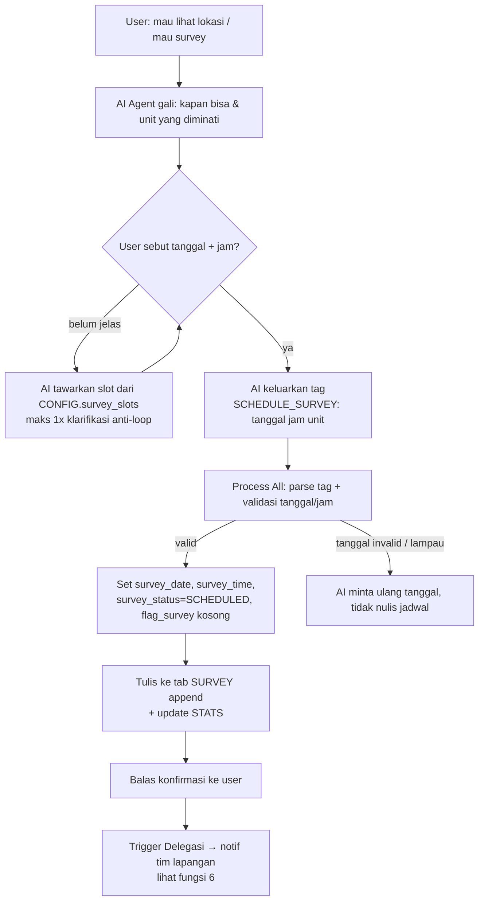
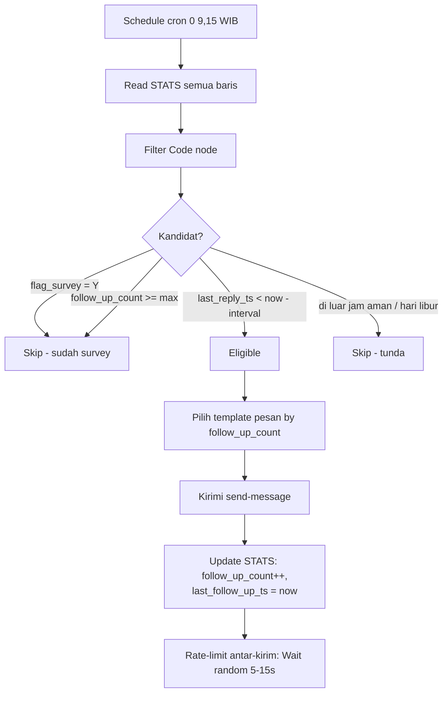
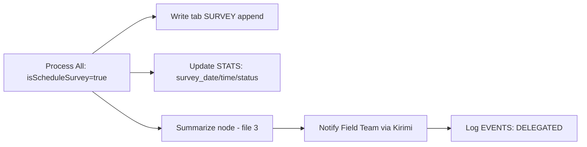
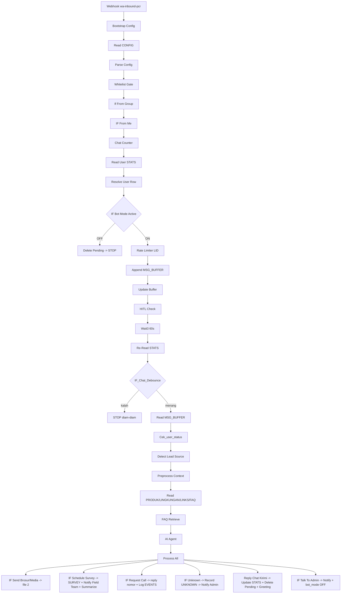

# Blueprint Arsitektur — VIRA Remake untuk Persada Cisoka Residence

**Tanggal:** 2026-07-15
**Penulis:** Agent Coding (Opus)
**Basis:** logika node VIRA V4 (production, 59 node) + lapisan config multi-tenant dari VIRA_TEMPLATE_v1
**Referensi wajib:** `2026-07-15-analisis-arsitektur-VIRA-eksisting.md` (dokumen analis) — dokumen ini menindaklanjutinya.

> **Prinsip pondasi (tidak boleh dilanggar, diturunkan dari V4):**
> 1. Identitas user: **No WA primer, lid backup, TIDAK PERNAH fallback `rows[0]`** (node `Resolve User Row`).
> 2. `MSG_BUFFER` **append-only** + **debounce 2-lapis** dipertahankan utuh.
> 3. Follow-up baru dirancang terhadap skema STATS V4 (`last_reply_ts`), **bukan** kolom `timestamp` legacy yang sudah tidak ditulis.
> 4. Semua secret (Kirimi `user_code`/`secret`/`device_id`, Sheet ID) pindah ke **n8n Credentials + tab CONFIG**, tidak hardcode seperti V4 production.
> 5. Setiap aksi terstruktur AI = pola tag `[...]` diparse regex di `Process All` + fallback pattern-matching + kolom STATS baru. **Jangan pernah reuse kolom internal debounce** (`timestamp`, `buffer_done_ts`, `process_start_ts`).

---

## 0. Peta Workflow (deploy terpisah di n8n)

| # | Workflow | Trigger | Fungsi | Basis |
|---|----------|---------|--------|-------|
| 1 | **VIRA-PCR Main** | Webhook `POST /wa-inbound-pcr` | Alur balas chat inbound (semua 6 fungsi inti kecuali follow-up) | V4 Main + config layer TEMPLATE |
| 2 | **VIRA-PCR Follow-Up** | Schedule cron `0 9,15 * * *` | Follow-up klien `flag_survey ≠ Y` | Redesain dari `VIRA_Follow_Up.json` (dipatch ke `last_reply_ts`) |
| 3 | **VIRA-PCR Error Notifier** | Error Trigger | Tangkap exception global → WA admin | Copy 1:1 `VIRA Error Notifier`, ganti nomor |
| 4 | **VIRA-PCR Buffer Cleanup** | Schedule cron `0 3 * * *` | Hapus `MSG_BUFFER` baris >2 jam | Copy 1:1 `VIRA - MSG_BUFFER Cleanup` |

Workflow #3 **harus di-set manual** di *Settings → Error Workflow* milik VIRA-PCR Main (tidak otomatis).

---

## 1. Automated Survey Scheduling

### 1.1 Alur percakapan (sampai jadwal tercatat)



### 1.2 Mekanisme AI menulis jadwal — **tag terstruktur, bukan tool/structured output**

**Rekomendasi: pakai pola tag `[SCHEDULE_SURVEY: ...]` yang diparse di `Process All`**, persis pola `[SEND_GFORM]`/`[FACTS]` yang sudah terbukti di produksi. Alasan:
- AI Agent V4 memakai Anthropic Chat Model **tanpa tool node** (system prompt eksplisit: "Kamu TIDAK punya tool"). Menambah function-calling tool = mengubah arsitektur inti + risiko regresi anti-halusinasi. Tag lebih murah & konsisten dengan sisa sistem.
- Tag diparse regex + **fallback pattern-matching** (kalau AI lupa tag) — pola defensif yang sudah ada di `Process All`.

**Format tag** (AI dipasang di baris paling akhir output, dibuang sebelum kirim ke user):
```
[SCHEDULE_SURVEY: tanggal="2026-07-20" | jam="10:00" | unit="Tipe 36/72"]
```

**Parsing di `Process All`** (blok baru, meniru gaya blok `[FACTS]`):
```js
// ── TAG: [SCHEDULE_SURVEY: ...] ──────────────────────────────
let isScheduleSurvey = false;
let surveyData = {};
const svMatch = aiOutput.match(/\[\s*SCHEDULE_SURVEY\b([^\]]*)\]/i);
if (svMatch && svMatch[1]) {
  const c = svMatch[1];
  const tgl  = (c.match(/tanggal\s*=\s*"([^"]*)"/i)  || [])[1] || '';
  const jam  = (c.match(/jam\s*=\s*"([^"]*)"/i)      || [])[1] || '';
  const unit = (c.match(/unit\s*=\s*"([^"]*)"/i)     || [])[1] || '';
  // ── VALIDASI tanggal/jam (deterministik di Code node, bukan diserahkan ke AI) ──
  const v = validateSurveySlot(tgl, jam); // helper di bawah
  if (v.ok) {
    isScheduleSurvey = true;
    surveyData = { tanggal: v.tanggal, jam: v.jam, unit: unit.trim() };
    console.log('📅 SCHEDULE_SURVEY valid:', JSON.stringify(surveyData));
  } else {
    console.warn('⚠️ SCHEDULE_SURVEY ditolak validasi:', v.reason);
    // tag dibuang, jadwal TIDAK ditulis; AI diharapkan sudah kasih kalimat minta ulang
  }
}
// buang tag dari cleanOutput
cleanOutput = cleanOutput.replace(/\[\s*SCHEDULE_SURVEY\b[^\]]*\]/gi, '');
```

**Helper validasi** (di dalam `Process All`, atau node terpisah `Validate Survey Slot`):
```js
function validateSurveySlot(tglRaw, jamRaw) {
  // Terima "2026-07-20" atau "20/07/2026" atau "20-07"; normalisasi ke ISO.
  const now = new Date();
  const WIB = t => new Date(t.toLocaleString('en-US', { timeZone: 'Asia/Jakarta' }));
  let d = null;
  const iso = tglRaw.match(/^(\d{4})-(\d{2})-(\d{2})$/);
  const dmy = tglRaw.match(/^(\d{1,2})[\/\-](\d{1,2})(?:[\/\-](\d{2,4}))?$/);
  if (iso)       d = new Date(+iso[1], +iso[2]-1, +iso[3]);
  else if (dmy)  d = new Date(dmy[3] ? (dmy[3].length===2?2000+ +dmy[3]:+dmy[3]) : now.getFullYear(), +dmy[2]-1, +dmy[1]);
  if (!d || isNaN(d)) return { ok:false, reason:'tanggal tidak terbaca' };

  const jm = jamRaw.match(/(\d{1,2})[:.](\d{2})/);
  if (!jm) return { ok:false, reason:'jam tidak terbaca' };
  const hh = +jm[1], mm = +jm[2];
  d.setHours(hh, mm, 0, 0);

  // Aturan bisnis (dari CONFIG): tidak boleh masa lampau, dalam jam operasional, bukan hari libur
  const todayWIB = WIB(now); todayWIB.setHours(0,0,0,0);
  if (d < todayWIB) return { ok:false, reason:'tanggal sudah lewat' };
  // jam operasional survey (ambil dari CONFIG.survey_open_hour/close_hour saat integrasi)
  if (hh < 8 || hh >= 17) return { ok:false, reason:'di luar jam operasional' };

  const pad = n => String(n).padStart(2,'0');
  return {
    ok: true,
    tanggal: `${d.getFullYear()}-${pad(d.getMonth()+1)}-${pad(d.getDate())}`,
    jam: `${pad(hh)}:${pad(mm)}`
  };
}
```

> Catatan: validasi tanggal/jam **deterministik di Code node** — jangan percaya AI memvalidasi masa-lampau/jam-operasional sendiri. AI hanya mengekstrak niat; Code node yang memutuskan valid/tidak. Kalau invalid, jadwal tidak ditulis dan AI (via instruksi prompt) sudah menyertakan kalimat minta ulang.

### 1.3 Skema tab Google Sheets baru — `SURVEY` (append-only log jadwal)

| Kolom | Tipe | Isi |
|-------|------|-----|
| `no_wa` | string | `resolved_key` (identitas dari Resolve User Row) |
| `lid` | string | LID backup |
| `nama` | string | nama user dari payload Kirimi |
| `tanggal` | string | ISO `YYYY-MM-DD` (hasil validasi) |
| `jam` | string | `HH:mm` WIB |
| `unit_diminati` | string | tipe unit (dari tag / STATS) |
| `status` | string | `SCHEDULED` / `DONE` / `CANCELLED` / `NO_SHOW` |
| `sumber_traffic` | string | dari STATS.lead_source (fungsi 4) |
| `catatan` | string | free text (opsional, diisi tim lapangan manual) |
| `created_ts` | number | unix ms saat jadwal dibuat |

Selain `SURVEY` (log historis append-only), status per-user tetap disimpan di **STATS** agar Follow-Up & HITL bisa membaca satu baris per user (lihat §7).

---

## 2. Follow-Up System (workflow terpisah #2)

### 2.1 Prinsip — dirancang terhadap skema STATS V4 (bukan `timestamp` legacy)

`VIRA_Follow_Up.json` lama membaca `STATS.timestamp` yang **sudah tidak ditulis** oleh V4 → jalur follow-up-nya diam-diam mati. Remake ini **membaca `last_reply_ts`** (unix detik, ditulis `Update to STATS` pasca-reply) sebagai penanda aktivitas terakhir, dan **`flag_survey`/`survey_status`** sebagai kondisi filter.

### 2.2 Alur



### 2.3 Aturan filter (node `Filter` baru, ambil parameter dari CONFIG)

```js
const rows = $('Read STATS').all().map(i => i.json);
const nowSec = Math.floor(Date.now() / 1000);
const cfg = $('Parse Config').first().json.config;

const MAX_FU        = cfg.followup_max || 3;                 // maks follow-up
const INTERVAL_SEC  = (cfg.followup_interval_hours || 24) * 3600;
const digits = v => String(v ?? '').replace(/\D/g, '');

// Jam aman kirim (WIB): jangan kirim malam/subuh
const hourWIB = Number(new Date().toLocaleString('en-US', { timeZone:'Asia/Jakarta', hour:'2-digit', hour12:false }));
const OPEN  = cfg.followup_open_hour  || 9;
const CLOSE = cfg.followup_close_hour || 18;
if (hourWIB < OPEN || hourWIB >= CLOSE) return [];  // di luar jam aman, tunda

const out = [];
for (const r of rows) {
  const noWa = digits(r['No WA']);
  if (!noWa) continue;                                        // identitas kosong -> skip
  if (String(r['bot_mode'] || '').toUpperCase() === 'OFF') continue; // HITL aktif -> jangan ganggu
  if (String(r['flag_survey'] || '').toUpperCase() === 'Y') continue; // sudah survey -> stop
  if (String(r['survey_status'] || '').toUpperCase() === 'SCHEDULED') continue; // sudah punya jadwal
  const fuCount = Number(r['follow_up_count'] || 0);
  if (fuCount >= MAX_FU) continue;                            // sudah maksimal

  const lastReply = Number(r['last_reply_ts'] || 0);          // ★ V4: pakai last_reply_ts, BUKAN timestamp
  const lastFu    = Number(r['last_follow_up_ts'] || 0);
  const lastTouch = Math.max(lastReply, lastFu);
  if (lastTouch === 0) continue;                              // belum pernah interaksi valid
  if (nowSec - lastTouch < INTERVAL_SEC) continue;            // belum waktunya

  out.push({ json: {
    no_wa: noWa,
    lid: digits(r['lid']),
    nama: r['Nama'] || '',
    fu_index: fuCount + 1,
    unit_interest: r['unit_interest'] || '',
    lead_source: r['lead_source'] || ''
  }});
}
return out;
```

### 2.4 Template pesan (dari CONFIG, indeks by `fu_index`)

Simpan sebagai JSON array di `CONFIG.followup_templates` supaya non-teknis bisa edit:
```json
["Halo, masih berminat lihat-lihat unit di Persada Cisoka Residence yaa? Kalau mau, saya bantu jadwalkan kunjungan.",
 "Halo, sekadar mengingatkan, unit di Persada Cisoka masih tersedia. Kalau mau lihat lokasinya langsung tinggal kabari saya yaa.",
 "Halo, ini info terakhir dari saya yaa. Kalau nanti berminat survey ke Persada Cisoka, boleh chat lagi kapan saja."]
```
Node menulis: `follow_up_count++`, `last_follow_up_ts = now`. **Anti-spam ganda**: filter menolak baris yang `last_follow_up_ts` masih dalam interval → 1 baris tidak bisa di-follow-up dua kali dalam window yang sama. `follow_up_count >= max` menghentikan permanen.

---

## 3. Call Redirection

### 3.1 Rekomendasi: deteksi intent di **system prompt (tag)**, bukan rule-based murni

**Rekomendasi: tag `[REQUEST_CALL]` dari AI Agent**, dengan fallback pattern-matching di `Process All` (jaring pengaman kalau AI lupa). Alasan:
- Intent "mau telepon" bervariasi bahasa ("bisa ditelpon?", "ada nomor yang bisa dihubungi?", "mau ngomong langsung", "CS-nya siapa"). Rule-based murni rapuh terhadap variasi; AI lebih tahan.
- Pola ini identik `[TALK_TO_SAM]` yang sudah jalan di V4 — reuse langsung.
- Fallback rule-based di `Process All` (daftar frasa) menutup kasus AI lupa tag, sama seperti fallback `[TALK_TO_SAM]`.

### 3.2 Implementasi

Tag: `[REQUEST_CALL]`. Balasan (AI menulis kalimat, nomor **disisipkan Code node** dari CONFIG — jangan biarkan AI mengarang nomor):
```js
// ── TAG: [REQUEST_CALL] ──────────────────────────────
let isRequestCall = aiOutput.includes('[REQUEST_CALL]');
if (!isRequestCall) {
  const low = aiOutput.toLowerCase();
  const callPatterns = ['nomor yang bisa dihubungi','bisa ditelpon','nomor telepon admin','hubungi langsung','minta nomornya'];
  if (callPatterns.some(p => low.includes(p))) isRequestCall = true;
}
cleanOutput = cleanOutput.replace(/\[REQUEST_CALL\]/g, '');
if (isRequestCall) {
  const adminPhone = ($('Parse Config').first().json.config.admin_phone_display) || '';
  if (adminPhone && !cleanOutput.includes(adminPhone)) {
    cleanOutput = `${cleanOutput}\n\nBisa langsung telepon/WA ke ${adminPhone} yaa.`;
  }
}
```

- Nomor yang **ditampilkan** ke user = `CONFIG.admin_phone_display` (format enak dibaca, mis. `0812-xxxx-xxxx`). Bedakan dari `CONFIG.admin_phone` (format `628xxx` untuk endpoint notif internal).
- Boleh juga simpan nomor di tab `LINKS` (baris `Nama Link = "Nomor Admin"`) supaya konsisten dengan pola data-driven LINKS — pilih salah satu, jangan dua-duanya (hindari sumber kebenaran ganda). **Rekomendasi: CONFIG** karena ini config, bukan URL.

### 3.3 Pencatatan event

Cabang `IF Request Call` → node **Log Call Request** (append ke tab `EVENTS`): `no_wa`, `nama`, `event="REQUEST_CALL"`, `ts`. Opsional: notif WA ke admin ("📞 [PCR] Minta telepon: <nama> <no_wa>") memakai pola `Notify Talk to Sam`.

---

## 4. Traffic Source Recognition

### 4.1 Rekomendasi: **rule-based matching di Code node SEBELUM AI Agent** (deterministik & murah), fallback ke AI

Ini persis rekomendasi dokumen analis. Template pembuka per kanal biasanya kaku ("Halo.. Persada Cisoka, Saya lihat di **Instagram**, mau tanya.."), jadi keyword match deterministik cukup dan tidak buang token AI. Deteksi **hanya saat `is_new_user`**, tulis **sekali** ke `STATS.lead_source`.

### 4.2 Implementasi — node `Detect Lead Source` (Code, letak: setelah `Cek_user_status`, sebelum/di dalam `Preprocess`)

```js
// Deteksi sumber traffic dari PESAN PERTAMA user (hanya saat user baru).
const pre  = $('Cek_user_status').first().json;
const firstMsg = String(pre.user_message_final || '').toLowerCase();
const cfg  = $('Parse Config').first().json.config;

// Peta keyword -> sumber. Ambil dari CONFIG.lead_source_map (editable non-teknis),
// default hardcode sebagai jaring.
const MAP = (cfg.lead_source_map && cfg.lead_source_map.length)
  ? cfg.lead_source_map
  : [
      { source:'Instagram', keywords:['instagram','ig','insta','dari ig','lihat di ig','story ig'] },
      { source:'Facebook',  keywords:['facebook','fb','dari fb','lihat di fb','marketplace'] },
      { source:'Google',    keywords:['google','search','nyari di google','gmaps','maps'] },
      { source:'TikTok',    keywords:['tiktok','tt','dari tiktok'] },
      { source:'WhatsApp',  keywords:['broadcast','wa blast','katalog wa'] },
    ];

let leadSource = '';
for (const m of MAP) {
  if (m.keywords.some(k => firstMsg.includes(k))) { leadSource = m.source; break; }
}
if (!leadSource) leadSource = 'Organik'; // tidak match -> Organik (fallback AI opsional, lihat catatan)

return [{ json: { ...pre, lead_source_detected: leadSource } }];
```

- **Tulis sekali**: node `Update to STATS` hanya menulis `lead_source` bila kolomnya masih kosong (pertahankan sumber pertama). Ekspresi mapping: tulis `lead_source_detected` hanya jika `STATS.lead_source` kosong — cek `row_found`/`is_new_user`.
- **Fallback ke AI** (opsional, kalau `Organik` terasa terlalu kasar): tambah instruksi ringan di system prompt agar AI mengeluarkan `[SOURCE: <kanal>]` bila menyebut kanal secara eksplisit tapi tak tertangkap keyword. Tapi untuk v1, rule-based + default `Organik` cukup.

### 4.3 Kolom
`STATS.lead_source` (string, ditulis sekali). Dipakai juga di tab `SURVEY.sumber_traffic` dan di summary handover (file 3).

---

## 5. Telemarketer Persona

### 5.1 Encoding

- **Persona + aturan** → `AI Agent.systemMessage` (lihat FILE 4 untuk draft lengkap). Kerangka V4 dipertahankan: blok `# IDENTITAS`, `# SUMBER FAKTA (anti-halusinasi)`, `# ALUR`, `# GAYA`, `# TAG`, `# LARANGAN`, ekor `{{ $json.data_context }}` + `{{ $json.faq_context }}`.
- **Data produk** (unit, harga, KPR, lingkungan) → **tab Google Sheets**, bukan hardcode di prompt, supaya non-teknis bisa update. Tab `PRODUK` (padanan `PROGRAM` di V4) dibaca `FAQ Retrieve` dan dirakit jadi `data_context`.

### 5.2 Tab `PRODUK` (padanan PROGRAM)

| Kolom | Isi |
|-------|-----|
| `Tipe Unit` | mis. "Tipe 36/72", "Tipe 45/90" |
| `Status` | Ready Stock / Indent / Sold Out |
| `Harga` | harga dasar |
| `Luas Bangunan` / `Luas Tanah` | m² |
| `Spesifikasi` | jumlah kamar, dll |
| `Skema KPR` | DP %, tenor, bank rekanan, estimasi cicilan |
| `Promo` | promo aktif (editable) |
| `Catatan` | free text |

Tab `LINGKUNGAN` / `ABOUT_DEV` (padanan `ABOUT_SAM`): `Aspek` | `Detail` (lokasi, akses tol, fasilitas umum, legalitas SHM/HGB, developer profile).

Tab `LINKS`: brosur, lokasi Gmaps, katalog, nomor admin — pola persis LINKS V4 (`Nama Link`, `Deskripsi`, `Status`, `URL`).

Tab `FAQ`: `Pertanyaan` | `Jawaban` | `Kategori` — dipakai retrieval lexical/TF-IDF (`FAQ Retrieve` reuse langsung).

---

## 6. Delegations (notifikasi tim lapangan)

### 6.1 Kapan dipicu
Begitu `[SCHEDULE_SURVEY]` **lolos validasi** (fungsi 1) → cabang `IF Schedule Survey` → notif WA otomatis ke **nomor tim lapangan** (`CONFIG.field_team_phone`, **terpisah** dari `admin_phone`).

### 6.2 Isi notifikasi (data klien + summary)
Reuse pola `Notify Talk to Sam` (HTTP Kirimi ke nomor internal). Isi pesan digabung summary dari FILE 3:
```
🏠 [PCR] SURVEY BARU TERJADWAL
Nama   : {{nama}}
No WA  : {{no_wa}}
Tanggal: {{tanggal}} {{jam}} WIB
Unit   : {{unit_diminati}}
Sumber : {{lead_source}}
Ringkasan: {{summary_singkat}}
```
`summary_singkat` = hasil node summarization (FILE 3). Untuk v1 tanpa summary, cukup field mentah dari STATS (`budget_range`, `unit_interest`).

### 6.3 Alur

`field_team_phone` bisa berupa **satu nomor** atau **array** (broadcast ke beberapa nomor tim) — kalau array, loop kirim dengan Wait antar-kirim (rate limit 60/menit, aman).

---

## 7. Skema Semua Tab Google Sheets (final)

Satu spreadsheet `Persada_Cisoka_Database`, ID di `Bootstrap Config` (satu-satunya edit manual).

### Tab `STATS` — state per user (key = `No WA`)
Warisi kolom V4 yang relevan, **buang** yang legacy (`timestamp`, `user_status`, `pending_msg`, `kelas_anak*`, `program_interest`). Tambah kolom domain properti:

| Kolom | Asal | Fungsi |
|-------|------|--------|
| `No WA` | V4 | primary key (`resolved_key`) |
| `lid` | V4 | identitas backup |
| `bot_mode` | V4 | ON/OFF (HITL) |
| `Nama`, `Pesan Pertama` | V4 | metadata |
| `Counter`, `Intensitas Chat` | V4 | penghitung |
| `Tanggal Chat Pertama/Terakhir`, `Jam Chat Terakhir` | V4 | aktivitas |
| `greeting_sent` | V4 | intro user baru terkirim? |
| `buffer_done_ts` | V4 | **watermark MSG_BUFFER (internal, jangan sentuh)** |
| `last_reply_ts` | V4 | unix detik balasan terakhir — **dipakai Follow-Up** |
| **`lead_source`** | BARU (fungsi 4) | Google/FB/IG/TikTok/Organik, tulis sekali |
| **`unit_interest`**, `unit_interest_ts` | BARU (pola `kelas_anak` TTL) | tipe unit diminati, persist TTL |
| **`budget_range`**, `budget_range_ts` | BARU | kisaran budget/KPR user |
| **`survey_date`**, **`survey_time`** | BARU (fungsi 1) | jadwal survey aktif |
| **`survey_status`** | BARU | SCHEDULED/DONE/CANCELLED/NO_SHOW |
| **`flag_survey`** | BARU (fungsi 2) | `Y` = sudah survey (stop follow-up) |
| **`follow_up_count`**, **`last_follow_up_ts`** | BARU/V4 | kontrol follow-up |

### Tab `MSG_BUFFER` — append-only (reuse V4 persis)
`no_wa`, `lid`, `message`, `ts` (unix ms).

### Tab `SURVEY` — log jadwal (baru, §1.3)
### Tab `PRODUK` — data unit/KPR (baru, §5.2)
### Tab `LINGKUNGAN` (ABOUT) — profil developer/lokasi/legalitas
### Tab `FAQ` — knowledge base tanya-jawab (reuse struktur V4)
### Tab `LINKS` — brosur/lokasi/nomor admin (reuse V4)
### Tab `UNKNOWN` — pertanyaan tak terjawab (reuse V4)
### Tab `EVENTS` — log call request / delegasi (baru): `no_wa`, `nama`, `event`, `detail`, `ts`
### Tab `CONFIG` — key-value multi-tenant (§8)

---

## 8. Daftar CONFIG Keys

**Warisan TEMPLATE** (dipertahankan): `client_name`, `system_prompt`, `admin_phone`, `bot_language`, `whitelist_enabled`, `whitelist_numbers`, `rate_limit_max`, `rate_limit_window_sec`, `debounce_seconds`, `*_keywords`.

> Catatan: `status_question` dan `grade_program_map` dari TEMPLATE **dibuang** (relik alur PARENT/STUDENT & taksonomi kelas beasiswa yang tidak relevan properti).

**Key baru Persada Cisoka:**

| Key | Tipe | Contoh | Fungsi |
|-----|------|--------|--------|
| `admin_phone` | string `628…` | `6281234567890` | endpoint notif internal (unknown/API error) |
| `admin_phone_display` | string | `0812-3456-7890` | nomor yang ditampilkan ke user (call redirection) |
| `field_team_phone` | JSON array `628…` | `["628111...","628222..."]` | notif delegasi survey ke tim lapangan |
| `brochure_url` | string (URL) | `https://drive.google.com/uc?export=download&id=…` | brosur PDF (FILE 2) |
| `media_catalog` | JSON array | `[{key:"brosur",url:"…",caption:"…"}]` | katalog media (FILE 2) |
| `survey_slots` | JSON array | `["Sen-Jum 09-16","Sabtu 09-13"]` | slot yang ditawarkan AI |
| `survey_open_hour` / `survey_close_hour` | number | `8` / `17` | jam operasional (validasi jadwal) |
| `followup_max` | number | `3` | maks follow-up |
| `followup_interval_hours` | number | `24` | jeda antar follow-up |
| `followup_open_hour` / `followup_close_hour` | number | `9` / `18` | jam aman kirim follow-up |
| `followup_templates` | JSON array | (§2.4) | template pesan follow-up |
| `lead_source_map` | JSON array | (§4.2) | keyword → sumber traffic |

---

## 9. Daftar Node: Reuse dari V4 vs Baru

### Pakai ulang langsung (copy, ganti kredensial → Credentials)
`Webhook`, `If From Group`, `IF From Me`, `Chat Counter`, `Read User STATS`, `Resolve User Row`, `IF Bot Mode Active`, `Rate Limiter LID`, `Append MSG_BUFFER`, `Update Buffer`, `Read STATS for HITL`, `HITL Check`, `Wait3`, `Re-Read STATS Debounce`, `IF_Chat_Debounce`, `Cek_user_status`, `Read FAQ`, `FAQ Retrieve`, `Anthropic Chat Model`, `Simple Memory`, `AI Agent` (struktur; systemMessage diganti), `Reply Chat Kirimi`, `Check API Response`, `Extract & Prepare Data`, `Process Counter & Merge Data`, `Update to STATS`, `Delete_Pending_Msg`, `Wait1`, `Reply Error`, seluruh workflow Error Notifier & Buffer Cleanup.

### Dari TEMPLATE (fork lapisan config)
`Bootstrap Config`, `Read CONFIG`, `Parse Config`, `Whitelist Gate` — **gantikan** `IF (Whitelist)` hardcode V4.

### Bangun baru
`Detect Lead Source` (fungsi 4), blok parsing `[SCHEDULE_SURVEY]`/`[REQUEST_CALL]` di `Process All`, `Validate Survey Slot`, `Write tab SURVEY`, `IF Schedule Survey`, `Notify Field Team`, `Log Call Request`, `Log EVENTS`, node Summarize (FILE 3), node kirim media (FILE 2), seluruh workflow Follow-Up baru.

### Modifikasi
`Preprocess - Context Detection` (ganti kosakata kelas → kosakata properti: tipe unit, budget, KPR, lokasi), `Read PROGRAM Data`→`Read PRODUK Data`, `Read ABOUT Data`→`Read LINGKUNGAN Data`, `Process All` (tambah blok tag baru, ganti taksonomi `[FACTS kelas]`→`[FACTS unit/budget]`, buang guard "register netral"/vokatif bila persona properti pakai "Bapak/Ibu").

---

## 10. Diagram Alur Utama (VIRA-PCR Main, ringkas)



---

## 11. Menunggu Data dari Klien (hasil Zoom/WA export)

Ditandai jelas agar tidak diisi asal:
- **Template teks pembuka per kanal** (fungsi 4) — perlu contoh persis tiap sumber untuk kalibrasi `lead_source_map`.
- **Data unit/harga/KPR/promo** (tab PRODUK) — dari developer.
- **Jam operasional survey & slot** (CONFIG).
- **Nomor admin & tim lapangan**.
- **Keputusan bisnis register sapaan**: properti Indonesia umumnya "Bapak/Ibu/Kak" — beda dari "register netral" V4. Perlu konfirmasi Steven/klien apakah persona menyapa atau netral (lihat FILE 4 §penanda).
- **File brosur final** (PDF/gambar) untuk di-host (FILE 2).
