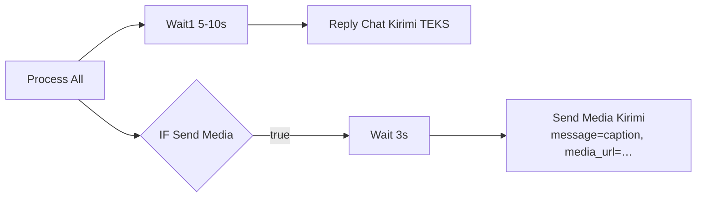

# Desain Fitur Kirim Media (Brosur PDF & Gambar) — VIRA Persada Cisoka

**Tanggal:** 2026-07-15
**Basis endpoint:** dokumentasi resmi Kirimi (dicek 2026-07-15).

> **FAKTA TERVERIFIKASI (memecahkan pertanyaan terbuka dokumen analis §6/§7):**
> Kirim media **TIDAK butuh endpoint baru**. Endpoint `POST https://api.kirimi.id/v1/send-message` menerima field **opsional `media_url`** (URL publik file). Cukup tambahkan `media_url` di call Kirimi yang sudah ada.
> - Media didukung: gambar (JPEG/PNG/GIF/WebP), dokumen (PDF/DOC/DOCX/XLS/XLSX/PPT/PPTX), video (MP4). Maks **64MB**.
> - Rate limit default **60 request/menit**.
> - Body lengkap: `user_code`, `device_id`, `receiver` (format `628xxx`), `message`, `secret`, `media_url` (opsional).

> ⚠️ **Catatan nama field.** Node Kirimi eksisting di VIRA V4 memakai key **`phone`** untuk nomor tujuan (`{ user_code, secret, device_id, phone, message }`). Dokumentasi resmi menyebut **`receiver`**. Kemungkinan gateway menerima keduanya (alias) atau V4 pakai varian lama. **Saat implementasi: verifikasi 1x dengan test call** — kalau `phone` sudah jalan di produksi V4, pertahankan `phone` demi konsistensi; kalau tidak, pakai `receiver`. Contoh di dokumen ini memakai `phone` (mengikuti node produksi yang terbukti jalan) dan mencatat `receiver` sebagai alternatif.

---

## 1. Logika Keputusan — Kapan AI Memutuskan Kirim Brosur

**Rekomendasi: pola tag `[SEND_MEDIA: <key>]` dari AI Agent, diparse di `Process All`** (identik pola `[SEND_GFORM]` yang sudah terbukti di produksi).

**Alasan memilih tag (bukan marker teks bebas atau tool call):**
1. Konsisten dengan seluruh arsitektur V4 (AI Agent tanpa tool; semua aksi terstruktur lewat tag regex-parsed).
2. `Process All` sudah punya infrastruktur parse tag + fallback + resolusi data dari sheet (`Read LINKS Data` → URL). Kirim media = kasus yang sama: AI sebut **key**, Code node resolve **URL + caption** dari katalog. AI tidak pernah mengarang URL.
3. Marker teks bebas ("saya kirim brosurnya yaa") rapuh; tapi tetap dipakai sebagai **fallback pattern-matching** kalau AI lupa tag (sama seperti fallback `[SEND_GFORM]`).

**Format tag:** `[SEND_MEDIA: brosur]` atau `[SEND_MEDIA: siteplan]` — `key` merujuk baris di katalog media (CONFIG/sheet).

---

## 2. Katalog Media (di CONFIG atau tab LINKS)

**Rekomendasi: tab `LINKS`** (reuse pola V4: `Nama Link`, `Deskripsi`, `Status`, `URL`) supaya satu registry untuk semua URL (brosur, siteplan, lokasi). Tambah kolom `Tipe` (`media`/`link`) dan `Caption`.

| Nama Link | Tipe | Status | URL | Caption |
|-----------|------|--------|-----|---------|
| `brosur` | media | Aktif | `https://drive.google.com/uc?export=download&id=FILE_ID` | `Ini brosur lengkap Persada Cisoka Residence yaa.` |
| `siteplan` | media | Aktif | `https://…/siteplan.jpg` | `Ini siteplan-nya yaa.` |
| `tipe36` | media | Aktif | `https://…/tipe36.jpg` | `Ini denah Tipe 36/72 yaa.` |
| `lokasi` | link | Aktif | `https://maps.app.goo.gl/…` | (link biasa, bukan media) |

Alternatif ringkas: `CONFIG.media_catalog` sebagai JSON array `[{key,url,caption}]`. **Pilih satu** — untuk konsistensi dengan `Read LINKS Data` yang sudah ada, LINKS lebih rapi.

---

## 3. Parsing di `Process All` (blok baru)

```js
// ── TAG: [SEND_MEDIA: <key>] ──────────────────────────────
let isSendMedia = false;
let mediaKey = '';
const mediaMatch = aiOutput.match(/\[\s*SEND_MEDIA\s*(?::\s*([^\]]*))?\]/i);
if (mediaMatch) {
  isSendMedia = true;
  mediaKey = (mediaMatch[1] || 'brosur').trim().toLowerCase();  // default: brosur
  console.log('📎 SEND_MEDIA tag:', mediaKey);
}
// Fallback: AI lupa tag tapi menjanjikan brosur
if (!isSendMedia) {
  const low = aiOutput.toLowerCase();
  const patt = ['kirim brosur','saya kirimkan brosur','ini brosurnya','brosurnya saya kirim','saya kirim siteplan','denahnya saya kirim'];
  if (patt.some(p => low.includes(p))) { isSendMedia = true; mediaKey = 'brosur'; console.log('⚠️ FALLBACK SEND_MEDIA'); }
}
cleanOutput = cleanOutput.replace(/\[\s*SEND_MEDIA\s*(?::[^\]]*)?\]/gi, '');

// ── Resolve media URL + caption dari LINKS (data-driven, AI tak mengarang URL) ──
let mediaUrl = '', mediaCaption = '';
if (isSendMedia) {
  let linkRows = [];
  try { linkRows = $('Read LINKS Data').all().map(i => i.json); } catch(e){}
  const norm = s => String(s || '').toLowerCase().replace(/\s+/g,' ').trim();
  const active = linkRows.filter(r => /aktif|active|on|ya/i.test(String(r['Status']||'')));
  const row = active.find(r => norm(r['Nama Link']) === mediaKey)
           || active.find(r => norm(r['Nama Link']).includes(mediaKey));
  if (row && row['URL']) {
    mediaUrl = String(row['URL']).trim();
    mediaCaption = String(row['Caption'] || '').trim();
  } else {
    console.warn('⚠️ SEND_MEDIA key tidak ketemu di LINKS:', mediaKey);
    isSendMedia = false; // gagal resolve -> jangan kirim media, teks tetap jalan
  }
}
```
Tambahkan ke `return` di `Process All`: `isSendMedia`, `mediaUrl`, `mediaCaption`.

---

## 4. Node Kirim Media — HTTP Request ke Kirimi (KODE SIAP PAKAI)

### 4.1 Cabang di workflow
`Process All` → `IF Send Media` (kondisi `{{ $json.isSendMedia }}` true) → **`Send Media Kirimi`** (HTTP Request node).

### 4.2 Konfigurasi HTTP Request node `Send Media Kirimi`

```
Method : POST
URL    : https://api.kirimi.id/v1/send-message
Send Body : true
Body Content Type : Form-Urlencoded (atau JSON — samakan dgn node Reply Chat Kirimi eksisting)
Body Parameters:
  user_code  = {{ $('Parse Config').first().json.config.kirimi_user_code }}
  secret     = {{ $('Parse Config').first().json.config.kirimi_secret }}
  device_id  = {{ $('Parse Config').first().json.config.kirimi_device_id }}
  phone      = {{ $('Chat Counter').first().json.user_wa }}
  message    = {{ $('Process All').item.json.mediaCaption }}
  media_url  = {{ $('Process All').item.json.mediaUrl }}
Options:
  timeout : 60000
Settings:
  continueOnFail : true
  onError : continueErrorOutput
  retryOnFail : true
  waitBetweenTries : 2000
```

> Kredensial Kirimi (`user_code`/`secret`/`device_id`) **diambil dari CONFIG/Credentials**, bukan hardcode seperti V4 production (risiko §7.1 dokumen analis). Tambahkan key `kirimi_user_code`, `kirimi_secret`, `kirimi_device_id` di tab CONFIG (atau n8n Credentials generic header/query).

### 4.3 Alternatif: Code node (kalau butuh logika kirim beberapa media / retry manual)

```js
// Node: Send Media (Code) — pakai bila perlu loop beberapa media / kontrol penuh
const cfg = $('Parse Config').first().json.config;
const pa  = $('Process All').item.json;
const phone = $('Chat Counter').first().json.user_wa;

async function kirimiSend({ phone, message, media_url }) {
  const body = {
    user_code: cfg.kirimi_user_code,
    secret:    cfg.kirimi_secret,
    device_id: cfg.kirimi_device_id,
    phone,                         // ganti ke `receiver` bila test menuntut nama field itu
    message: message || '',
  };
  if (media_url) body.media_url = media_url;

  const res = await this.helpers.httpRequest({
    method: 'POST',
    url: 'https://api.kirimi.id/v1/send-message',
    body,
    json: true,
    timeout: 60000,
  });
  return res;
}

const out = [];
try {
  const r = await kirimiSend({ phone, message: pa.mediaCaption, media_url: pa.mediaUrl });
  console.log('✅ Media terkirim:', pa.mediaUrl, JSON.stringify(r).slice(0,200));
  out.push({ json: { ok: true, media_url: pa.mediaUrl, resp: r } });
} catch (e) {
  console.error('🚨 Gagal kirim media:', e.message);
  out.push({ json: { ok: false, media_url: pa.mediaUrl, error: e.message } });
}
return out;
```

---

## 5. Urutan Kirim (teks dulu atau media dulu?)

**Rekomendasi: TEKS DULU, lalu MEDIA.**

Alasan:
1. Alur V4 sudah mengirim balasan teks utama lewat `Reply Chat Kirimi` (cabang `Wait1 → Reply Chat Kirimi`) yang **selalu jalan**. Media adalah **cabang tambahan paralel** dari `Process All`, bukan pengganti.
2. Secara UX WhatsApp: user membaca konteks ("Ini brosur lengkapnya yaa") lalu menerima file — lebih natural daripada file muncul tanpa konteks.
3. `mediaCaption` di call media berfungsi sebagai caption singkat file, **bukan** pengganti balasan utama. Balasan substantif tetap di `cleanOutput` via `Reply Chat Kirimi`.

**Implementasi urutan** tanpa race:
- Cabang media diberi **`Wait` singkat (2-3 detik)** setelah `Process All`, sehingga `Reply Chat Kirimi` (teks) hampir pasti terkirim lebih dulu. Pola ini sama dengan `Wait2` sebelum `Notify Admin Unknown` di V4.
- Jangan gabung teks panjang + media dalam satu call: caption Kirimi untuk media sebaiknya pendek (1 kalimat). Balasan detail = call teks terpisah.



---

## 6. Penanganan Error & Rate Limit

### 6.1 Error
- Node media pakai `continueOnFail: true` + `onError: continueErrorOutput` (sama pola `Reply Chat Kirimi` V4). **Kegagalan kirim media TIDAK boleh menggagalkan balasan teks** yang sudah terkirim.
- Cabang error → `Notify Admin Media Error` (WA ke `admin_phone`): `🚨 [PCR] Gagal kirim media <key> ke <no_wa>: <error>`. Reuse pola `Notify Admin API Error`.
- **Guard URL kosong**: kalau `mediaUrl` kosong (gagal resolve di §3), cabang media di-skip diam-diam — user tetap dapat teks. Jangan kirim call dengan `media_url` kosong (akan error di gateway).

### 6.2 Rate limit (60 request/menit)
- Volume normal 1 klien jauh di bawah 60/menit. Risiko hanya saat **follow-up massal** atau **broadcast delegasi ke banyak nomor tim**.
- Mitigasi: `Wait` random 5-15 detik antar-kirim di loop follow-up/broadcast (sudah ada di desain Follow-Up FILE 1 §2.2).
- Kalau gateway balas HTTP 429: node `retryOnFail: true` + `waitBetweenTries: 2000` menangani retry ringan. Untuk aman, tambah backoff di Code node bila error mengandung `429`/`rate`.

```js
// contoh backoff sederhana dalam Code node loop
if (String(e.message).match(/429|rate/i)) {
  await new Promise(r => setTimeout(r, 30000)); // tunggu 30s lalu retry sekali
}
```

---

## 7. Panduan Hosting File Brosur

Kirimi butuh **URL publik direct-download**. Opsi:

| Opsi | Cara | Trade-off |
|------|------|-----------|
| **Google Drive** (direct-download) | Upload → set "Anyone with the link" → format URL: `https://drive.google.com/uc?export=download&id=FILE_ID` (ambil `FILE_ID` dari share link `/d/FILE_ID/view`) | ✅ gratis, familiar. ⚠️ file besar (>~100MB) memicu halaman "virus scan" antara → **brosur PCR kecil (<25MB) aman**, di bawah limit 64MB Kirimi. ⚠️ URL bisa berubah bila file dipindah; kuota download harian bisa kena kalau viral. |
| **Cloudinary / imgur** (gambar) | Upload, ambil direct URL | ✅ CDN cepat, cocok gambar (siteplan/denah). ⚠️ akun tambahan; PDF kurang ideal di imgur. |
| **Object storage** (S3/R2/Spaces) | Upload, set public-read, pakai URL objek | ✅ paling stabil & profesional, URL permanen, mendukung PDF & gambar. ⚠️ butuh setup akun + sedikit biaya; overkill untuk 1 brosur. |
| **Hosting web klien** | Taruh di `persadacisoka.com/brosur.pdf` | ✅ URL branded, permanen. ⚠️ butuh akses hosting klien. |
| **Supabase Storage / Firebase Storage** | Bucket public | ✅ gratis tier, URL stabil, mudah. ⚠️ akun tambahan. |

**Rekomendasi:** untuk MVP cepat → **Google Drive direct-download** (brosur PCR pasti <64MB). Untuk produksi jangka panjang → **object storage / hosting klien** (URL permanen, tidak kena kuota Drive). Simpan URL final di tab `LINKS.URL` sehingga ganti file = ganti 1 sel, non-teknis bisa lakukan.

**Verifikasi sebelum go-live:** buka `media_url` di browser incognito — harus **langsung mengunduh/menampilkan file**, bukan halaman preview/login. Kalau muncul preview Drive, formatnya salah (pakai `uc?export=download&id=` bukan `/view`).

---

## 8. Checklist Implementasi

- [ ] Test call Kirimi: konfirmasi field nomor (`phone` vs `receiver`) & `media_url` diterima.
- [ ] Pindah kredensial Kirimi ke CONFIG/Credentials (jangan hardcode).
- [ ] Isi tab `LINKS` baris media (`brosur`, `siteplan`, `tipe…`) + kolom `Tipe`/`Caption`.
- [ ] Host brosur, verifikasi direct-download di incognito.
- [ ] Tambah blok parse `[SEND_MEDIA]` di `Process All` + fallback.
- [ ] Tambah cabang `IF Send Media → Wait 3s → Send Media Kirimi` + cabang error.
- [ ] Tambah instruksi tag `[SEND_MEDIA]` di system prompt (FILE 4).
- [ ] Uji urutan: teks sampai duluan, media menyusul dengan caption.
