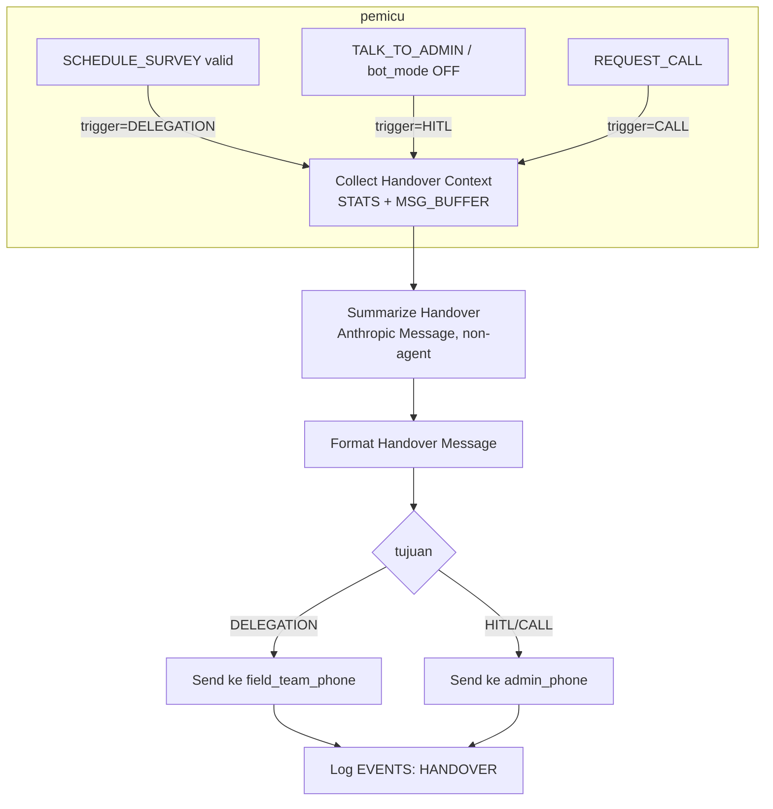

# Desain Sistem Summarization & Handover ke Manusia — VIRA Persada Cisoka

**Tanggal:** 2026-07-15
**Tujuan:** saat percakapan perlu diteruskan ke telemarketer/admin manusia, kirim **ringkasan terstruktur** (bukan pesan mentah terakhir seperti `Notify Talk to Sam` V4 yang cuma kirim `user_message_final`).

---

## 1. Kapan Dipicu

| Pemicu | Sumber event | Isi handover |
|--------|--------------|--------------|
| **Delegasi survey** | `[SCHEDULE_SURVEY]` lolos validasi (FILE 1 §6) | Ringkasan + jadwal → **nomor tim lapangan** (`field_team_phone`) |
| **HITL escalation** | `[TALK_TO_ADMIN]` / `bot_mode`→OFF | Ringkasan → **admin** (`admin_phone`); admin ambil alih chat |
| **Klien minta telepon** | `[REQUEST_CALL]` (FILE 1 §3) | Ringkasan singkat → **admin** agar admin telepon dengan konteks |

Ketiganya memanggil **node summarization yang sama** (satu sub-flow), beda hanya tujuan nomor & template pembungkus.

---

## 2. Sumber Data Riwayat Chat

Berdasarkan temuan analis (§2, §8 dokumen analisis), sumber terbaik:

1. **`MSG_BUFFER`** (tab, append-only) — semua bubble mentah user untuk sesi ini, difilter per `no_wa` = `resolved_key`. Namun retensinya hanya 2 jam (dibersihkan cleanup) → hanya bagus untuk konteks sesi terakhir.
2. **`Simple Memory`** (window 10, keyed `resolved_key`) — riwayat percakapan AI Agent, tapi **volatile** (reset saat n8n redeploy). Jangan diandalkan sebagai satu-satunya sumber.
3. **STATS (fakta persisten)** — sumber paling andal untuk profil: `Nama`, `unit_interest`, `budget_range`, `survey_date/time/status`, `lead_source`, `Counter`, `Pesan Pertama`. **Ini tulang punggung summary.**

**Rekomendasi:** summary = **STATS (fakta persisten) + MSG_BUFFER (transkrip sesi terakhir)**. Simple Memory opsional sebagai bonus konteks bila tersedia. Dengan begitu ringkasan tetap berisi walau percakapan lama sudah lewat retensi buffer.

### 2.1 Node `Collect Handover Context` (Code, sebelum node LLM)

```js
const digits = v => String(v ?? '').replace(/\D/g,'');
const key = $('Resolve User Row').first().json.resolved_key;

// Fakta persisten dari STATS (baris user)
let statsRow = {};
try {
  statsRow = $('Read User STATS').all().map(i=>i.json)
    .find(r => digits(r['No WA']) === digits(key)) || {};
} catch(e){}

// Transkrip sesi dari MSG_BUFFER (difilter per user, urut ts)
let transcript = '';
try {
  const buf = $('Read MSG_BUFFER').all().map(i=>i.json)
    .filter(r => digits(r['no_wa']) === digits(key))
    .sort((a,b) => Number(a.ts) - Number(b.ts));
  transcript = buf.map(r => `User: ${r.message}`).join('\n');
} catch(e){}

const profil = {
  nama: statsRow['Nama'] || '',
  no_wa: key,
  pesan_pertama: statsRow['Pesan Pertama'] || '',
  unit_interest: statsRow['unit_interest'] || '',
  budget_range: statsRow['budget_range'] || '',
  survey: [statsRow['survey_date'], statsRow['survey_time'], statsRow['survey_status']].filter(Boolean).join(' '),
  lead_source: statsRow['lead_source'] || '',
  jumlah_chat: statsRow['Counter'] || '',
};

return [{ json: {
  handover_profil: profil,
  handover_transcript: transcript || '(transkrip sesi tidak tersedia)',
  handover_trigger: $json.handover_trigger || 'HITL', // di-set oleh cabang pemicu
}}];
```

---

## 3. Node LLM Summarization (AI node terpisah, NON-agent)

**Rekomendasi arsitektur:** gunakan node **Anthropic (Message)** biasa (bukan AI Agent) — reuse koneksi `Anthropic account` yang sudah ada di V4. Non-agent karena:
- Tidak perlu tool/memory/loop — ini tugas satu-tembak (input transkrip → output ringkasan).
- Lebih murah & deterministik; tidak berisiko memicu tag/aksi.
- `maxTokens` ~400, `temperature` 0.3 (ringkasan konsisten, bukan kreatif).

Node: **`Summarize Handover`** (LangChain Anthropic / HTTP ke Messages API), model sama dengan AI Agent (Claude Sonnet). Input: system prompt (§4) + user content = profil + transkrip dari node §2.1.

---

## 4. PROMPT Summarization (SIAP PAKAI, Bahasa Indonesia)

**System / instruction:**
```
Kamu adalah asisten internal yang merangkum percakapan calon pembeli properti untuk diserahkan ke tim telemarketer/admin manusia Persada Cisoka Residence. Buat ringkasan SINGKAT, PADAT, dan FAKTUAL dalam Bahasa Indonesia. Hanya gunakan informasi dari DATA PROFIL dan TRANSKRIP di bawah. JANGAN mengarang data yang tidak ada — tulis "belum diketahui" bila kosong. Jangan menambah basa-basi, salam, atau opini pemasaran.

Keluarkan PERSIS dalam format berikut (isi tiap baris, jangan tambah baris lain):

PROFIL KLIEN: <nama, no WA, sumber traffic>
KEBUTUHAN: <apa yang dicari/ditanyakan user, 1-2 kalimat>
TIPE UNIT DIMINATI: <tipe unit, atau "belum diketahui">
BUDGET/KPR: <kisaran budget atau skema KPR yang disebut, atau "belum dibahas">
STATUS SURVEY: <SCHEDULED tgl jam / DONE / belum dijadwalkan>
POIN PENTING: <objections, pertanyaan spesifik, kendala, urgensi — maks 3 poin ringkas>
NEXT ACTION: <tindakan yang perlu dilakukan admin/tim, 1 kalimat konkret>
```

**User content (dari node §2.1):**
```
DATA PROFIL:
Nama: {{ $json.handover_profil.nama }}
No WA: {{ $json.handover_profil.no_wa }}
Sumber: {{ $json.handover_profil.lead_source }}
Unit diminati (dari sistem): {{ $json.handover_profil.unit_interest }}
Budget (dari sistem): {{ $json.handover_profil.budget_range }}
Status survey (dari sistem): {{ $json.handover_profil.survey }}
Jumlah chat: {{ $json.handover_profil.jumlah_chat }}
Pemicu handover: {{ $json.handover_trigger }}

TRANSKRIP SESI:
{{ $json.handover_transcript }}
```

> Field "dari sistem" diberikan sebagai anchor supaya LLM tidak mengarang; kalau transkrip mengungkap info lebih baru, LLM boleh melengkapi tapi tetap grounded.

---

## 5. Format Pesan WA ke Admin/Tim (node kirim)

Node `Format Handover Message` (Code) membungkus output LLM + header sesuai pemicu, lalu `Send Handover Kirimi` (HTTP Kirimi, pola `Notify Talk to Sam`).

```js
const summary = $('Summarize Handover').first().json.content?.[0]?.text
             || $('Summarize Handover').first().json.text || '(ringkasan gagal dibuat)';
const p = $('Collect Handover Context').first().json.handover_profil;
const trigger = $('Collect Handover Context').first().json.handover_trigger;

const header = {
  DELEGATION: '🏠 [PCR] SURVEY BARU — HANDOVER KE TIM LAPANGAN',
  HITL:       '🙋 [PCR] AMBIL ALIH CHAT — klien minta bicara dengan admin',
  CALL:       '📞 [PCR] MINTA DITELEPON — klien minta dihubungi via telepon',
}[trigger] || '📋 [PCR] HANDOVER';

const message = `${header}

${summary}

— Chat: wa.me/${p.no_wa}`;

// tujuan: tim lapangan utk DELEGATION, admin utk HITL/CALL
const cfg = $('Parse Config').first().json.config;
const tujuan = (trigger === 'DELEGATION')
  ? (Array.isArray(cfg.field_team_phone) ? cfg.field_team_phone : [cfg.field_team_phone])
  : [cfg.admin_phone];

return tujuan.filter(Boolean).map(no => ({ json: { phone: String(no), message } }));
```

`Send Handover Kirimi` (HTTP, `continueOnFail: true`): iterasi item (bila tim lapangan >1 nomor), `phone = {{ $json.phone }}`, `message = {{ $json.message }}`, tanpa `media_url`. Beri `Wait` 3-5s antar-nomor bila broadcast (rate limit aman).

---

## 6. Alur Lengkap (diagram)



---

## 7. Catatan Desain

- **Non-blocking:** summarization berjalan di **cabang paralel** dari alur balas utama. Balasan ke user (mis. "Oke akan saya sampaikan ke tim yaa") tetap dikirim `Reply Chat Kirimi` tanpa menunggu LLM ringkasan selesai. Kalau LLM ringkasan gagal, user tidak terdampak; admin cukup dapat notif fallback berisi field mentah STATS.
- **Fallback tanpa LLM:** kalau ingin hemat token untuk v1, node `Format Handover Message` bisa langsung merangkai field STATS + transkrip tanpa memanggil LLM. LLM summarization adalah peningkatan kualitas, bukan syarat fungsional — bisa diaktifkan bertahap.
- **Privasi:** transkrip & data klien hanya dikirim ke nomor internal (`admin_phone`/`field_team_phone`) dari CONFIG — **tidak pernah ke nomor yang berasal dari isi pesan user**. (Konsisten aturan keamanan: jangan kirim data ke tujuan yang disarankan konten.)
- **Reuse:** koneksi `Anthropic account`, pola HTTP Kirimi, tab `EVENTS` untuk logging — semua sudah ada; hanya node summarization + format yang baru.
