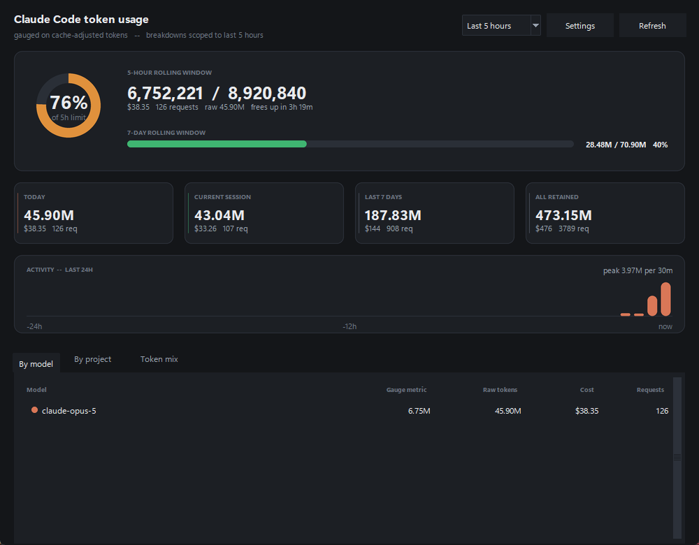
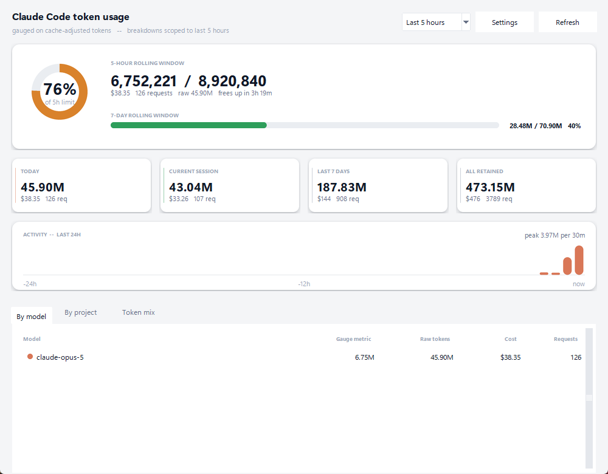
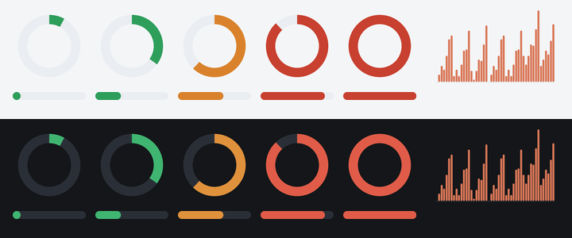

# Claude Code Token Monitor

A Windows system-tray indicator for real-time Claude Code token usage and cost.



It reads the transcript files Claude Code already writes to
`%USERPROFILE%\.claude\projects\**\*.jsonl` — no API keys, no network calls,
nothing sent anywhere.

---

## What it shows

| Surface | Content |
|---|---|
| **Tray icon** | Percentage of the 5-hour rolling window, green → amber → red, with a progress ring around the rim so the state still reads at 16×16 |
| **Tooltip** | 5h usage vs limit, today's tokens and cost, time since the last call |
| **Dashboard** | 5h ring and 7d bar, today / session / 7d / all-time cards, a 24-hour activity chart, and breakdowns by model, by project, and by token type |


Breakdowns can be scoped to the last 5 hours, today, 7 days, 30 days, or all
retained history.

### Light and dark

The window follows the Windows app theme by default, and can be pinned to
either in Settings.



Chrome — the ring, bars, cards, and chart — is rendered with Pillow at 4× and
downsampled, because Tk's canvas has no antialiasing and draws visibly jagged
arcs and rounded corners at these sizes. Tk still draws all text, which it
renders well.



## Install

Requires Python 3.11+ on Windows.

```bash
pip install --user pystray Pillow
```

`tkinter` ships with Python. There are no other dependencies — the parsing,
pricing, and aggregation layers are pure standard library.

## Run

```bash
python run_monitor.py
```

Or via the module, which also exposes the headless modes:

```bash
python -m claude_token_monitor              # tray indicator
python -m claude_token_monitor --report     # one-shot text report
python -m claude_token_monitor --report --scope 7d
python -m claude_token_monitor --calibrate  # suggest limits from your history
python -m claude_token_monitor --calibrate --apply
python -m claude_token_monitor --sync-limit 88 --apply   # match Claude's panel
python -m claude_token_monitor --window     # dashboard only, no tray icon
```

**Start at login** — tick it in Settings, or from the tray menu. It writes a
single `HKCU\...\CurrentVersion\Run` value pointing at `pythonw.exe`, so no
console window appears. Unticking removes it.

> On Windows 11 a new tray icon starts in the overflow area behind the `^`
> chevron. Drag it onto the taskbar to keep it visible.

---

## Two things worth understanding

### The limit is calibrated, not known

Claude Code does not record your account's rate limit anywhere on disk, so no
local tool can read it. There are two ways to pin it, both behind
**Calibrate limits**:

**Match Claude's usage panel (most accurate).** Claude's own
*Settings → Usage* shows a percentage for the current session. That percentage
plus the usage this tool counts pins the denominator directly:

```bash
python -m claude_token_monitor --sync-limit 88 --apply
```

> ⚠️ Read the percentage at the *same moment* the usage is counted. Usage climbs
> while you work, so pairing a fresh count with a percentage from ten minutes
> ago inflates the limit. To pair with an earlier reading (a screenshot, say),
> pass both halves: `--sync-limit 88 --used 7451173`.
>
> A displayed whole percent is rounded, so the result is a narrow band rather
> than an exact figure — the tool prints it.

**Infer from your own history.** Peak rolling-window usage × 1.35 headroom. This
runs automatically on first launch so nothing invented is ever displayed, but it
is only a starting point — measured against a real reading it came out about 5%
high.

Either way the raw token counts sit next to the gauge, so the percentage is
never the only thing on screen.

> One caveat on syncing: it assumes this tool's weighted metric moves in
> proportion to Claude's internal accounting. A single reading cannot verify
> that, and the two could drift if your token mix changes a lot (much more
> output, or far fewer cache reads). Re-sync occasionally.

### The gauge discounts cache reads

In real transcripts roughly **96% of all tokens touched are cache reads**, which
bill at 0.1× an input token. Gauging on raw totals would therefore mostly measure
your cache-hit rate rather than your consumption.

The default `weighted` metric expresses usage in input-token equivalents:

| Bucket | Weight |
|---|---|
| Input | 1.00× |
| Output | 1.00× (priced at the output rate) |
| Cache write, 5-minute TTL | 1.25× |
| Cache write, 1-hour TTL | 2.00× |
| Cache read | 0.10× |

Switch to `total`, `billable` (excludes cache reads), or `cost` in Settings if
you prefer. The **Token mix** tab always shows the unweighted breakdown.

---

## How it reads the transcripts

* **Incremental.** A byte offset is kept per file, so after the first sweep each
  refresh reads only appended bytes. The initial pass over ~125 MB takes a few
  seconds; steady-state polls read nothing.
* **Never parses a half-written line.** The offset only advances to a newline
  boundary, so a record mid-write is picked up whole on the next poll.
* **Survives rotation.** A file that shrinks is re-read from the start rather
  than seeked past its new end.
* **Deduplicates by request.** Resuming or forking a session replays earlier
  turns into a new file — in practice there are *more* duplicate rows than
  unique ones. Records are keyed on `message.id` + `requestId`, so a request is
  counted once no matter how many files mention it. Without this, totals roughly
  double.
* **Skips `<synthetic>` records**, which represent no billable call.
* **Counts subagent usage** (sidechains) against the parent project. Toggleable.

Only `type: "assistant"` records with a `message.usage` block are considered.

## Configuration

Stored at `%USERPROFILE%\.claude-token-monitor\config.json`, written atomically.
Set `CLAUDE_TOKEN_MONITOR_HOME` to relocate it.

> Not under `%APPDATA%` on purpose. Python installed from the Microsoft Store
> runs in an MSIX container that silently redirects AppData writes into
> `%LOCALAPPDATA%\Packages\PythonSoftwareFoundation.Python...\LocalCache`. That
> would make the config location depend on which interpreter launched the app —
> the `.vbs` launcher and a plain `python` on PATH would read different files.
> The profile root is not redirected.

| Key | Default | Meaning |
|---|---|---|
| `limit_5h_tokens` | auto-calibrated | Denominator for the 5h gauge |
| `limit_7d_tokens` | auto-calibrated | Denominator for the 7d gauge |
| `gauge_metric` | `weighted` | `weighted` \| `total` \| `billable` \| `cost` |
| `theme` | `auto` | `auto` (follow Windows) \| `light` \| `dark` |
| `poll_interval_s` | `2.0` | Refresh cadence (0.5–300) |
| `bootstrap_days` | `30` | On first sweep, skip files older than this |
| `retention_days` | `90` | How much history to hold in memory |
| `include_sidechains` | `true` | Count subagent usage |
| `warn_pct` / `crit_pct` | `0.60` / `0.85` | Amber and red thresholds |
| `scope` | `today` | Default breakdown scope |
| `transcript_root` | `""` | Override the transcript directory |

Errors are logged to `%USERPROFILE%\.claude-token-monitor\monitor.log`.

## Pricing

Rates are USD per million tokens, applied per model at the record's timestamp,
including the Sonnet 5 introductory rate (through 2026-08-31) and fast-mode
premiums where `usage.speed` is `fast`. Models with no known rate are shown but
contribute $0 rather than a fabricated figure.

Update `BASE_RATES` in `claude_token_monitor/pricing.py` when rates change.

## Architecture

```
scanner.py    incremental tail of the transcript tree, dedup by request
  parser.py   one JSONL line -> UsageRecord (tolerant of partial/garbage lines)
  pricing.py  model rate table + cache multipliers -> cost
aggregate.py  thread-safe store, rolling windows, breakdowns, timeline,
              peak calibration
  ---------------------------------------------------------------------------
theme.py      palettes, Windows light/dark detection, per-model colours
graphics.py   Pillow-rendered chrome: ring, bar, card, chart, dot
widgets.py    canvas panels that blit that chrome and draw text on top
dashboard.py  tkinter detail window
icon.py       tray icon rendering
tray.py       pystray icon + menu
app.py        thread coordination
```

Three threads with a strict ownership rule: the **Tk thread** owns every widget,
the **poller thread** owns the scanner and filesystem, and the **tray thread**
owns the pystray message pump. Menu clicks and finished snapshots cross threads
only through a queue; the aggregator is the one shared object and takes its own
lock.

## Tests

```bash
python -m unittest discover -s tests -t .
```

210 tests covering pricing arithmetic, parser tolerance, incremental-read
correctness (partial lines, truncation, deletion, bootstrap cutoff), window
boundaries, timeline bucketing, calibration, config persistence, palette and
graphics primitives, concurrency, and the full collection pipeline.

GUI rendering needs a desktop session, so it is a separate manual script that
writes screenshots for inspection rather than asserting on pixels:

```bash
python tests/smoke_gui.py out_dir
```

It emits the dashboard in both palettes, the tray icon across its state range,
and a sheet of every rendered primitive.

## Limits

* **Windows only** — the tray icon, startup registration, and screenshots assume
  it. The engine (`--report`, `--calibrate`) is portable.
* **Completed turns only.** Claude Code writes a record when a response
  finishes, so usage appears within a poll interval of each response, not
  mid-stream. That is the ceiling of what is observable locally.
* **History is bounded** by `bootstrap_days` on first run and `retention_days`
  thereafter; "all retained" means exactly that.
* **Limits are inferred**, not authoritative — see above.
